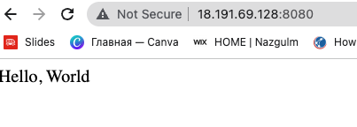

# Run web server on the instance

Deploy the simplest web architecture: a single wb server that can respond to HTTP request

1; Run web server using shell script passed through User Data
It will run  a web server on EC2 instance and web server will run at port 8080

2; Create a new AWS Security Group
Allow EC2 instance to receive traffic on port 8080

3: Link EC2 instance to use security group
Need to tell the EC2 instance to actually use it by passing the ID fo the security_group_ID into the vpc_security_group_id argument of the aws_instance resource using the expression.

```
provider "aws" {
  region = "us-east-2"
}

resource "aws_instance" "naza" {
  ami                    = "ami-0fb653ca2d3203ac1"
  instance_type          = "t2.micro"
  vpc_security_group_ids = [aws_security_group.instance.id]
  user_data = <<-EOF
              #!/bin/bash
              echo "Hello, World" > index.html
              nohup busybox httpd -f -p 8080 &
              EOF

  user_data_replace_on_change = true

  tags = {
    Name = "terraform-example"
  }
}


resource "aws_security_group" "instance" {
  name = "terraform-example-instance"
  ingress {
    from_port   = 8080
    to_port     = 8080
    protocol    = "tcp"
    cidr_blocks = ["0.0.0.0/0"]
  }
}
```

```
terraform init
terraform apply -auto-approve
```



Clean up
```
terraform destroy -auto-approve
```
